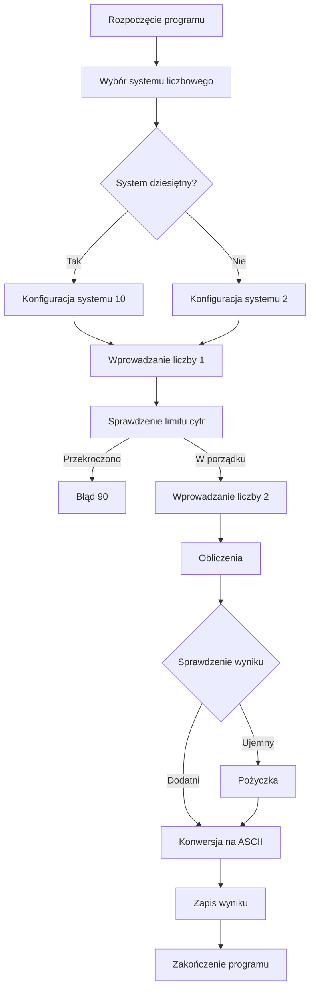

 # Odejmowanie w SMS32v50
---

## 📌 Treść projektu
Pisemne odejmowanie w systemie dwójkowym i dziesiętnym. Wyboru systemu użytkownik dokonuje na początku działania programu. Liczby wprowadzane są z klawiatury, a wynik wyświetla się na wyświetlaczu VDU. Zalecane jest także wyświetlanie wprowadzanych liczb. Dodawane liczby mają 1-10 cyfr. Jeżeli podczas wprowadzania zostanie podane więcej niż 10 cyfr, to fakt ten zostanie zasygnalizowany na sygnalizacji świetlnej. Podobnie należy zasygnalizować przekroczenie 10 cyfr w wynikowej liczbie.

---

## 📌 Spis treści  
1. [Treść projektu](#📌-treść-projektu)  
2. [Instrukcja uruchomienia](#📌-instrukcja-uruchomienia)  
3. [Opis działania programu i założenia](#📌-opis-działania-programu-i-założenia)  
4. [Logika działania (Schemat blokowy)](#🧠-logika-działania-schemat-blokowy)  
5. [Kluczowe algorytmy](#🔑-kluczowe-algorytmy)  
   - [Inicjalizacja systemu](#1️⃣-inicjalizacja-systemu)  
   - [Wprowadzanie liczb](#2️⃣-wprowadzanie-liczb)  
   - [Mechanizm odejmowania](#3️⃣-mechanizm-odejmowania)  
   - [Obsługa pożyczki](#4️⃣-obsługa-pożyczki)  
   - [Konwersja i wyświetlenie wyniku](#5️⃣-konwersja-i-wyświetlenie-wyniku)  
   - [Obsługa błędów](#6️⃣-obsługa-błędów)  
6. [Szczegóły techniczne](#🛠️-szczegóły-techniczne)  
7. [Testowanie](#🧪-testowanie)  
   - [Przypadek 1: Odejmowanie dziesiętne](#✅-przypadek-1-odejmowanie-dziesiętne)  
   - [Przypadek 2: Odejmowanie dziesiętne (wynik ujemny)](#✅-przypadek-2-odejmowanie-dziesiętne-wynik-ujemny)  
   - [Przypadek 3: Odejmowanie binarne](#✅-przypadek-3-odejmowanie-binarne)  
   - [Przypadek 4: Odejmowanie binarne (wynik ujemny)](#✅-przypadek-4-odejmowanie-binarne-wynik-ujemny)  
   - [Przypadek 5: Błąd przekroczenia](#🚨-przypadek-5-błąd-przekroczenia)  
8. [🎮 Symulator w HTML](#🎮-symulator-w-html-tego-zadania-z-podobną-zasadą-działania)  
9. [Dokumentacja](#📚-dokumentacja)  
10. [Autor i wersja](#📝-autor-i-wersja)   

---

## 📌 Instrukcja uruchomienia
Aby uruchomić program w emulatorze **SMS32v50**, otwórz odpowiedni plik w programie:

- **[kod_main.asm](kod_main.asm)** – krótka wersja kodu z krótkimi komentarzami.
- **[kod_dok.asm](kod_dok.asm)** – wersja z pełną dokumentacją, komentarzami i podziałem na sekcje.

---

## 📌 Opis działania programu i założenia
Program realizuje odejmowanie liczb w systemie dziesiętnym lub binarnym. Główne założenia i funkcjonalność:

1. **Wybór systemu liczbowego** - Użytkownik na początku działania programu wybiera system dziesiętny lub binarny.
2. **Wprowadzanie liczb** - Program odczytuje liczby z klawiatury i przechowuje je w pamięci.
3. **Obsługa limitu cyfr** - Maksymalna długość liczby to 10 cyfr, przekroczenie limitu sygnalizowane jest diodą LED.
4. **Mechanizm odejmowania** - Realizowany cyfrowo, z obsługą pożyczki w przypadku wartości ujemnych.
5. **Wyświetlanie wyników** - Wynik operacji jest konwertowany na ASCII i prezentowany na wyświetlaczu VDU.
6. **Obsługa błędów** - Program sygnalizuje przekroczenie limitów cyfr oraz błędy obliczeniowe diodą LED.

---

## 🧠 Logika działania (Schemat blokowy)


---

## 🔑 Kluczowe algorytmy

### 1️⃣ Inicjalizacja systemu
**Resetuje flagi i rejestry, a następnie pobiera wybór systemu liczbowego.**

```assembly
CLO             ; Czyścimy pamięć programu
IN 00           ; Oczekiwanie na wybór użytkownika: '1' - system dziesiętny, reszta - binarny
CMP AL, 31      ; Sprawdzamy, czy wciśnięto '1' (ASCII 31)
JZ system_dziesietny  ; Jeśli tak, przechodzimy do systemu dziesiętnego
MOV AL, 2       ; W przeciwnym razie ustawiamy system binarny
MOV [BC], AL    ; Zapisujemy wybór użytkownika w pamięci
JMP wprowadz_liczby  ; Przechodzimy do etapu wprowadzania liczb
```

### 2️⃣ Wprowadzanie liczb
**Program pobiera cyfry od użytkownika, sprawdza limit długości i zapisuje dane w pamięci.**

- Odczyt znaków z klawiatury
- Sprawdzenie, czy użytkownik nacisnął ENTER (oznacza koniec liczby)
- Kontrola, czy liczba nie przekroczyła 10 cyfr
- Zapisanie cyfry w odpowiedniej komórce pamięci
- Obsługa drugiej liczby po zakończeniu wpisywania pierwszej

```assembly
petla_wprowadzania:
IN 00           ; Pobieramy cyfrę z klawiatury
CMP AL, 0D      ; Sprawdzamy, czy wciśnięto ENTER (ASCII 0D)
JZ krok         ; Jeśli tak, przechodzimy do obliczeń
CMP CL, DL      ; Sprawdzamy, czy liczba nie przekroczyła 10 cyfr
JZ blad_przekroczenia  ; Jeśli tak, zgłaszamy błąd
MOV [CL], AL    ; Zapisujemy cyfrę w pamięci
INC CL          ; Przechodzimy do następnej cyfry
JMP petla_wprowadzania  ; Powtarzamy pętlę dla kolejnej cyfry
```

### 3️⃣ Mechanizm odejmowania
**Główna pętla wykonuje odejmowanie cyfrowe, obsługuje sytuacje wymagające pożyczki i sprawdza poprawność obliczeń.**

- Pobranie cyfry z drugiej liczby
- Przejście do pierwszej liczby i wykonanie odejmowania
- Obsługa sytuacji, w której wynik jest ujemny (pożyczka)
- Przejście do kolejnej cyfry i kontynuowanie obliczeń

```assembly
petla_obliczen:
CMP CL, CF      ; Sprawdzamy, czy zakończono obliczenia
JZ koniec_programu  ; Jeśli tak, kończymy program
MOV AL, [CL]    ; Pobieramy cyfrę z drugiej liczby
CMP AL, 20      ; Sprawdzamy, czy to spacja (ASCII 20)
JZ koniec_programu  ; Jeśli tak, kończymy program
SUB CL, 10      ; Przechodzimy do pierwszej cyfry
MOV BL, [CL]    ; Pobieramy cyfrę z pierwszej liczby
ADD CL, 20      ; Przechodzimy do miejsca wyniku
SUB BL, AL      ; Odejmujemy drugą cyfrę od pierwszej
PUSH BL         ; Zapisujemy wynik na stosie
POP AL          ; Pobieramy wynik ze stosu
CMP AL, 0       ; Sprawdzamy, czy wynik jest ujemny
JS pozyczka     ; Jeśli tak, przechodzimy do obsługi pożyczki
JMP wypisz_wynik  ; Jeśli nie, przechodzimy do wyświetlenia wyniku
```

### 4️⃣ Obsługa pożyczki
**Jeśli wynik odejmowania jest ujemny, program wykonuje pożyczkę i koryguje wynik.**

```assembly
pozyczka:
ADD AL, DL      ; Dodajemy wartość systemu (2 lub 10), żeby poprawić wynik
DEC CL          ; Cofamy się do poprzedniej cyfry
MOV BL, [CL]    ; Pobieramy wartość
DEC BL          ; Odejmujemy 1 (pożyczka)
MOV [CL], BL    ; Zapisujemy nową wartość
ADD CL, 10      ; Wracamy do właściwej cyfry
```

### 5️⃣ Konwersja i wyświetlenie wyniku
**Po zakończeniu obliczeń wynik jest konwertowany na ASCII i wyświetlany na ekranie.**

```assembly
ADD AL, 30      ; Konwersja wyniku na ASCII
MOV [CL], AL    ; Zapisujemy wynik w pamięci
```

### 6️⃣ Obsługa błędów
**Jeżeli użytkownik przekroczy limit cyfr, program wyświetli błąd i zapali diodę LED.**

```assembly
blad_przekroczenia:
MOV AL, 90      ; Przypisanie do AL wartości 90 (czerwone światło)
OUT 01          ; Wyświetlenie czerwonego światła na wyjściu 01
```
---

## 🛠️ Szczegóły techniczne

- **Rejestry:**  
  - `AL/BL` – operacje na cyfrach  
  - `CL/DL` – wskaźniki i liczniki  
- **Pamięć:**  
  - `C1-CB` – pierwsza liczba  
  - `D1-DB` – druga liczba  
  - `E0-EF` – wynik  
- **Flagi:**  
  - `ZF` – wykrywanie ENTER  
  - `CF` – kontrola pożyczek  
  - `SF` – wykrywanie wyników ujemnych  

---

## 🧪 Testowanie
### ✅ Przypadek 1: Odejmowanie dziesiętne
```
Wybierz system: 1
Liczba 1: 345
Liczba 2: 100
Wynik: 245
```


### ✅ Przypadek 2: Odejmowanie dziesiętne (przy wyniku na minusie)
```
Wybierz system: 1
Liczba 1: 8
Liczba 2: 9
Wynik: BŁąd
```

- w tym przypadku, gdy liczba jest ujemna wyświetla się kod błędu `90`

### ✅ Przypadek 3: Odejmowanie binarne
```
Wybierz system: 0
Liczba 1: 1111  --->  10-tny: 15
Liczba 2: 0111  --->  10-tny: 7
Wynik: 1000     --->  10-tny: 5
```


### ✅ Przypadek 4: Odejmowanie binarne (przy wyniku na minusie)
```
Wybierz system: 0
Liczba 1: 0011  --->  10-tny: 3
Liczba 2: 0101  --->  10-tny: 5
Wynik: 1000     --->  10-tny: 5
```


### 🚨 Przypadek 5: Błąd przekroczenia
```
Wprowadzasz: 7382736564 --->  Brak ostatniej liczby ze wzgledu na przekroczenie limitu
SYSTEM LED: Czerwony (kod 90)
```


---

## 🎮 Symulator w HTML tego zadania (z podobną zasadą działania)  

Zrobiłem to w ramach zajawki, aby lepiej zrozumieć działanie systemu.  

[Dostępne tutaj na stronie internetowej](http://woocaash.pl/sms/)  

---

## 📚 Dokumentacja
Pełna dokumentacja kodu dostępna w pliku [dokumentacja](dokumentacja.md).

---

## 🔬 Zaległe prace z labolatorii
[Dostępne tutaj na stronie internetowej](http://woocaash.pl/zalegle/) 

---
**📝 Autor:** [Łukasz Kopański]  
**📖 Nr albumu:** 91667
**📌 Wersja:** 1.0  
**📅 Ostatnia aktualizacja:** 2025-01-29  
